###########################
How to run blackbox-testing
###########################

.. contents::

=============
Prerequisites
=============

Before running EdgeX black-box test using the Newman script and Postman, you must install the following:

- docker
- docker-compose
- Postman https://www.getpostman.com/apps

You must also clone the repo from https://github.com/edgexfoundry/blackbox-testing

============
Setup env.sh
============
To set up the environment variables for the test script, do the following:

1.Open the **path/to/blackbox-testing/deploy-edgeX.sh** file and uncomment the following code snippet:

. $(dirname "$0")/bin/env.sh

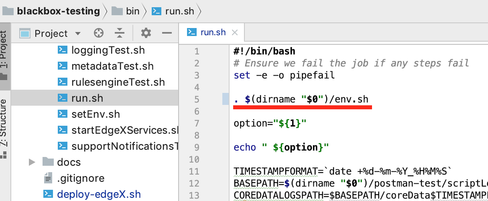

2. Open the **path/to/blackbox-testing/bin/run.sh** file and uncomment the following code snippet:

. $(dirname "$0")/env.sh

============
Deploy EdgeX
============

Change directory to **path/to/blackbox-testing/**, and execute the following command:

.. code-block:: bash

        $ bash deploy-edgeX.sh

The console displays output similar to the following:

.. code-block:: bash

    $ bash deploy-edgeX.sh
    Starting.. volume
    WARNING! Using --password via the CLI is insecure. Use --password-stdin.
    Login Succeeded
    Creating network "blackbox-testing_edgex-network" with driver "bridge"
    Creating blackbox-testing_volume_1 ... done
    Starting.. consul
    WARNING! Using --password via the CLI is insecure. Use --password-stdin.
    Login Succeeded
    blackbox-testing_volume_1 is up-to-date
    Creating blackbox-testing_consul_1 ... done
    ...
    ...
    Starting.. command
    WARNING! Using --password via the CLI is insecure. Use --password-stdin.
    Login Succeeded
    blackbox-testing_volume_1 is up-to-date
    blackbox-testing_mongo_1 is up-to-date
    blackbox-testing_consul_1 is up-to-date
    blackbox-testing_logging_1 is up-to-date
    blackbox-testing_metadata_1 is up-to-date
    Creating blackbox-testing_command_1 ... done

2. Check the EdgeX services using the **docker ps** command, as shown below:

.. code-block:: bash

    $ docker ps
    CONTAINER ID        IMAGE                                                              COMMAND                  CREATED             STATUS              PORTS                                                                                                            NAMES
    f1b490b3e0c3        nexus3.edgexfoundry.org:10004/docker-core-command-go:0.5.2         "/core-command --con…"   3 minutes ago       Up 3 minutes        0.0.0.0:48082->48082/tcp                                                                                         blackbox-testing_command_1
    055dc4d48442        nexus3.edgexfoundry.org:10004/docker-core-data-go:0.5.2            "/core-data --consul…"   3 minutes ago       Up 3 minutes        0.0.0.0:48080->48080/tcp, 0.0.0.0:32781->5563/tcp                                                                blackbox-testing_data_1
    e0aa5a675d7d        nexus3.edgexfoundry.org:10004/docker-core-metadata-go:0.5.2        "/core-metadata --co…"   3 minutes ago       Up 3 minutes        0.0.0.0:48081->48081/tcp, 48082/tcp                                                                              blackbox-testing_metadata_1
    deaa276c175f        nexus3.edgexfoundry.org:10004/docker-support-notifications:0.5.0   "/bin/sh -c 'java -j…"   3 minutes ago       Up 3 minutes        0.0.0.0:48060->48060/tcp                                                                                         blackbox-testing_notifications_1
    18336488dba4        nexus3.edgexfoundry.org:10004/docker-support-logging-go:0.5.2      "/support-logging --…"   4 minutes ago       Up 4 minutes        0.0.0.0:48061->48061/tcp                                                                                         blackbox-testing_logging_1
    05896fe88e17        nexus3.edgexfoundry.org:10004/docker-edgex-mongo:master            "docker-entrypoint.s…"   4 minutes ago       Up 4 minutes        0.0.0.0:27017->27017/tcp                                                                                         blackbox-testing_mongo_1
    85d0e33c4924        nexus3.edgexfoundry.org:10004/docker-core-config-seed-go:master    "docker-entrypoint.s…"   4 minutes ago       Up 4 minutes        8300-8302/tcp, 8400/tcp, 8500/tcp, 8301-8302/udp, 8600/tcp, 8600/udp                                             blackbox-testing_config-seed_1
    9e4bf85969d7        consul:1.1.0                                                       "docker-entrypoint.s…"   4 minutes ago       Up 4 minutes        0.0.0.0:8400->8400/tcp, 8301-8302/udp, 0.0.0.0:8500->8500/tcp, 8300-8302/tcp, 8600/udp, 0.0.0.0:8600->8600/tcp   blackbox-testing_consul_1
    47f532468383        nexus3.edgexfoundry.org:10004/docker-edgex-volume:master           "/bin/sh -c '/usr/bi…"   4 minutes ago       Up 4 minutes                                                                                                                         blackbox-testing_volume_1

=====================
Run Test Using Newman
=====================

The script logic is as follows:

- Import test data into Edgex
- Run the Newman test script
- Clean test data

For example, when we execute **bash ./bin/run.sh -cd**, then the script logic is:

- Import core-data's test data into Edgex
- Run core-data's test script
- Clean core-data's test data

The output is similar to the following:

.. code-block:: bash

    $ bash ./bin/run.sh -cd
    -cd
    *********************************************************************
     _____    _           __  __  _____                     _            
    | ____|__| | __ _  ___\ \/ / |  ___|__  _   _ _ __   __| |_ __ _   _ 
    |  _| / _` |/ _` |/ _ \\  /  | |_ / _ \| | | | '_ \ / _` | '__| | | |
    | |__| (_| | (_| |  __//  \  |  _| (_) | |_| | | | | (_| | |  | |_| |
    |_____\__,_|\__, |\___/_/\_\ |_|  \___/ \__,_|_| |_|\__,_|_|   \__, |
                |___/                                              |___/ 
    
    *********************************************************************
                       COMPONENT BLACKBOX TEST HARNESS
                               Version: Alpha
    *********************************************************************
    
    [INFO] Init postman test data .
    Info: Initiating Coredata Test
    
    ...
    ...
    ...

    Starting blackbox-testing_volume_1 ... done
    newman
    
    core-data
    
    ❏ event_error_4xx
    ↳ 05 http://localhost:48080/api/v1/event
    PUT edgex-core-data:48080/api/v1/event [404 Not Found, 173B, 26ms]
    ✓  Status code is 404
    ✓  Response time is less than 800
    
    ↳ 16 http://localhost:48080/api/v1/event/id/:id
    PUT edgex-core-data:48080/api/v1/event/id/57e866d4e4b0ca8e6d73a412 [404 Not Found, 173B, 4ms]
    ✓  Status code is 404
    ✓  Response time is less than 800
    
    ↳ 13 http://localhost:48080/api/v1/event/id/:id
    DELETE edgex-core-data:48080/api/v1/event/id/57e866d4e4b0ca8e6d73a412 [404 Not Found, 173B, 3ms]
    ✓  Status code is 404
    ✓  Response time is less than 800
    
    ↳ 18 http://localhost:48080/api/v1/event/device/:deviceId/{limit}
    GET edgex-core-data:48080/api/v1/event/device/57e866d4e4b0ca8e6d73a412/100 [200 OK, 110B, 2ms]
    ✓  Response time is less than 800
    
    ↳ 100 http://localhost:48080/api/v1/event/device/:deviceId
    DELETE edgex-core-data:48080/api/v1/event/device/preassureSensor [200 OK, 108B, 2ms]
    ✓  Response time is less than 800
    
    ↳ 22 http://localhost:48080/api/v1/event/device/:deviceId
    DELETE edgex-core-data:48080/api/v1/event/device/57e866d4e4b0ca8e6d73a412 [200 OK, 108B, 2ms]
    ✓  Response time is less than 800
    
    ┌─────────────────────────┬──────────┬──────────┐
    │                         │ executed │   failed │
    ├─────────────────────────┼──────────┼──────────┤
    │              iterations │        1 │        0 │
    ├─────────────────────────┼──────────┼──────────┤
    │                requests │        6 │        0 │
    ├─────────────────────────┼──────────┼──────────┤
    │            test-scripts │        6 │        0 │
    ├─────────────────────────┼──────────┼──────────┤
    │      prerequest-scripts │        0 │        0 │
    ├─────────────────────────┼──────────┼──────────┤
    │              assertions │        9 │        0 │
    ├─────────────────────────┴──────────┴──────────┤
    │ total run duration: 283ms                     │
    ├───────────────────────────────────────────────┤
    │ total data received: 53B (approx)             │
    ├───────────────────────────────────────────────┤
    │ average response time: 6ms                    │
    └───────────────────────────────────────────────┘

After deploying services, we can test the service's API using the following commands:

======================  ======================
Testservice             command 
----------------------  ----------------------    
support-rulesengine	     bash ./bin/run.sh -ru
support-notification	 bash ./bin/run.sh -sn
support-logging	         bash ./bin/run.sh -log
export-client	         bash ./bin/run.sh -exc
core-metadata	         bash ./bin/run.sh -md
core-data	             bash ./bin/run.sh -cd
core-command	         bash ./bin/run.sh -co
All	                     bash ./bin/run.sh -all 
======================  ======================

You can run bash ./bin/run.sh to list these options:

.. code-block:: bash

    $ bash ./bin/run.sh
    ...
    ...
    [INFO] Init postman test data .
    run.sh:usage: [-cd Coredata] | [-md Metadata] | [-co Command] | [-sn SupportNotification] | [-lo Logging] | [-exc Export Client] | [-ru Rulesengine] | [-all All]

----------------------------------------------
Present Test Result Using the Allure Framework
----------------------------------------------

Install Allure: https://docs.qameta.io/allure/#_get_started

Allure is based on standard xUnit results output. Once we have finished running the Newman script, the built-in JUnit reporter outputs a summary of the collection run to a JUnit compatible XML file. (Path: /blackbox-testing/bin/testResult/)

Generate report using the following command:

.. code-block:: bash

    $ allure serve /path-to-blackbox-testing-directory/blackbox-testing/bin/testResult

After executing the allure serve command, the following information is displayed in the terminal:

1. The location of the generated report

2. The URL to visit the report

3. The operation to stop the local Allure web server (Ctrl+C)

For example:

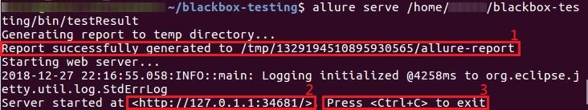

For more information about the Allure framework, visit https://docs.qameta.io/allure/

------------------------------------------
Running Newman Tests for Local Development
------------------------------------------

Newman can also be used to test locally running EdgeX code quickly.

First, install Newman on your command line with NPM. Instructions on how to install NPM are widely available for your
 operating system.

.. code-block:: bash

    $ npm install -g newman

Tests can now be executed on a per folder basis with the following syntax:

.. code-block:: bash

    $ newman run /path-to-blackbox-testing-directory/bin/postman-test/collections/collection_name.postman_collection
    .json
        --folder folder_name
        -e bin/postman-test/environment/environment_name.postman_environment.json
        -d bin/postman-test/data/data_name.json

where "collection_name" is the name of the collection (usually the name of the service under test), the "folder_name" is
 the name of the component under test, the "environment_name" is the name of the environment the test should be run
 under (usually the name of the service under test, with separate environments for running natively and running in a
 Docker container) and "data_name" is the name of the data file for that test, usually corresponding to the name of
 the folder.

======================
Run Test Using Postman
======================

The test uses same logic as **bash ./bin/run.sh -cd**, but there are more steps to complete.

We will use the core-data test below as an example.

---------------------------
Import test data into Edgex
---------------------------

1. Add the script located at **path/to/blackbox-testing/bin/postman-test/collections/core-data-importer.postman_collection.json**

1-1. Drop, or select, the file in the Import dialog box

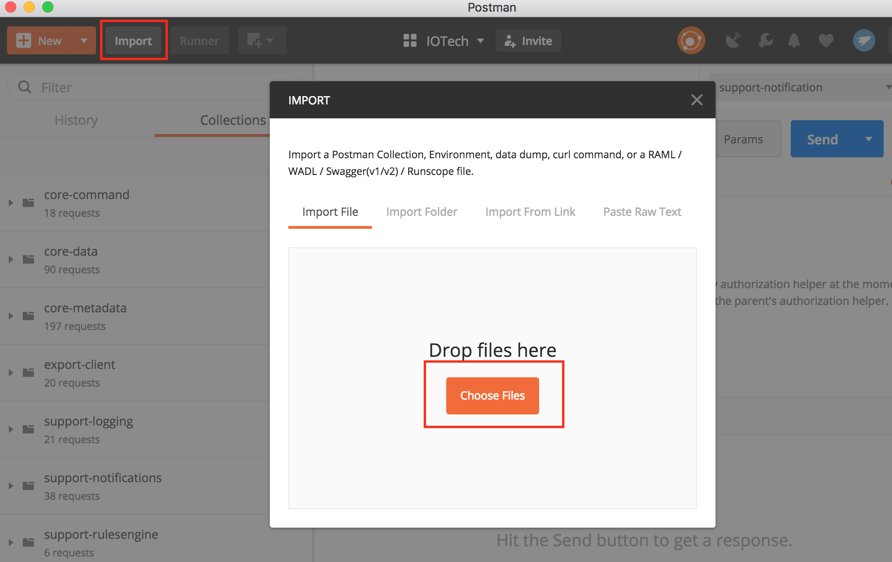

1-2. Select the Pre-requisite Scriot tab to view the prepared test data:

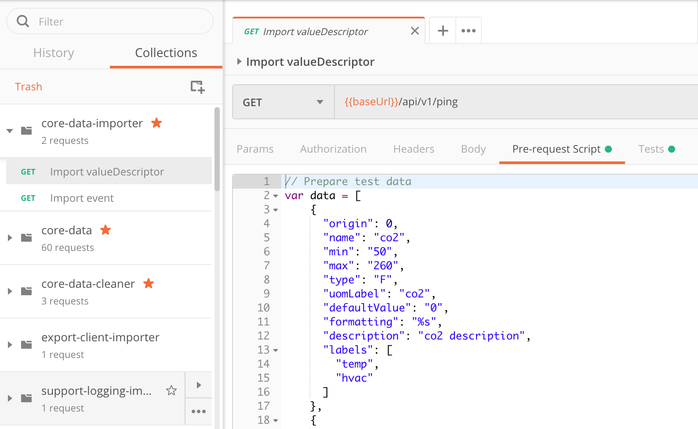

1-3.  Select the Tests tab to view the script. This script executes POST API to add new test data.

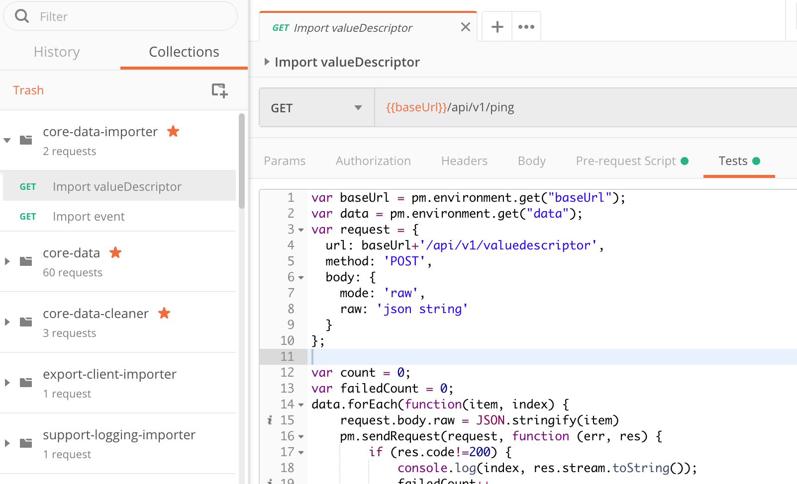

2. Import the environment from **path/to/blackbox-testing/bin/postman-test/environment/core-data.postman_environment.json**

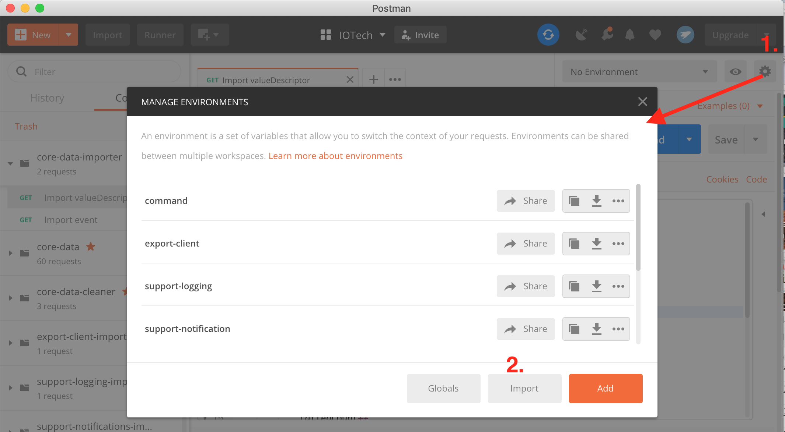
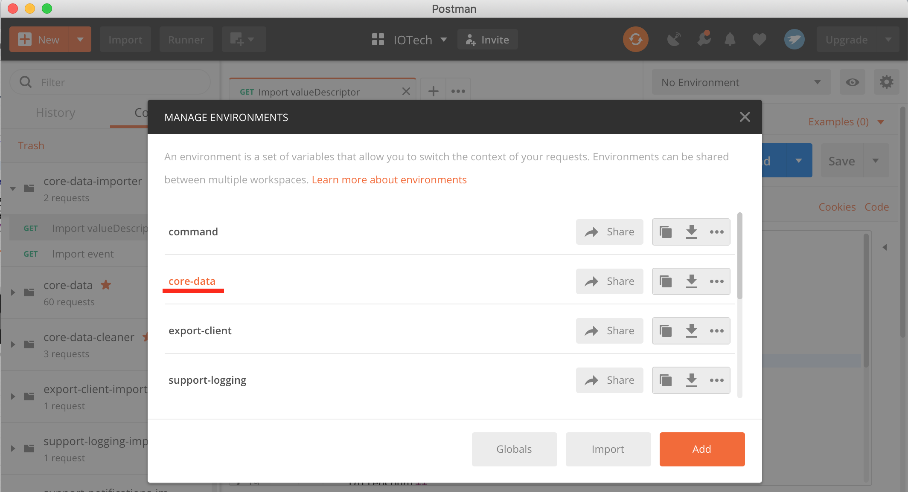

3.  Execute the import script in one of the following ways:

3-1.  Execute the import scripts one-by-one

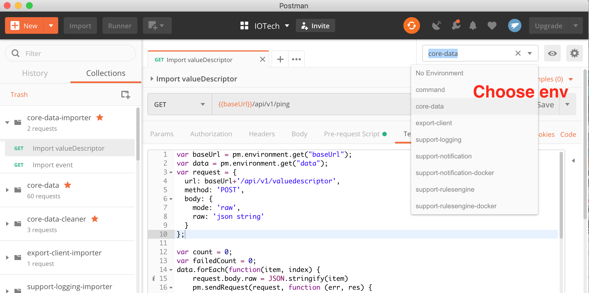
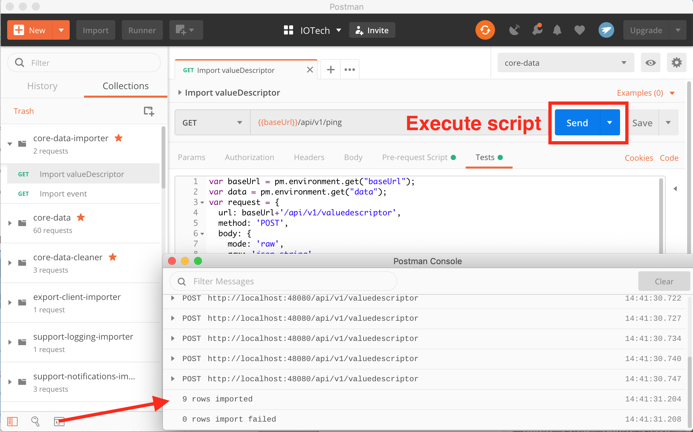

3-2. Execute the import scripts using Postman Runner

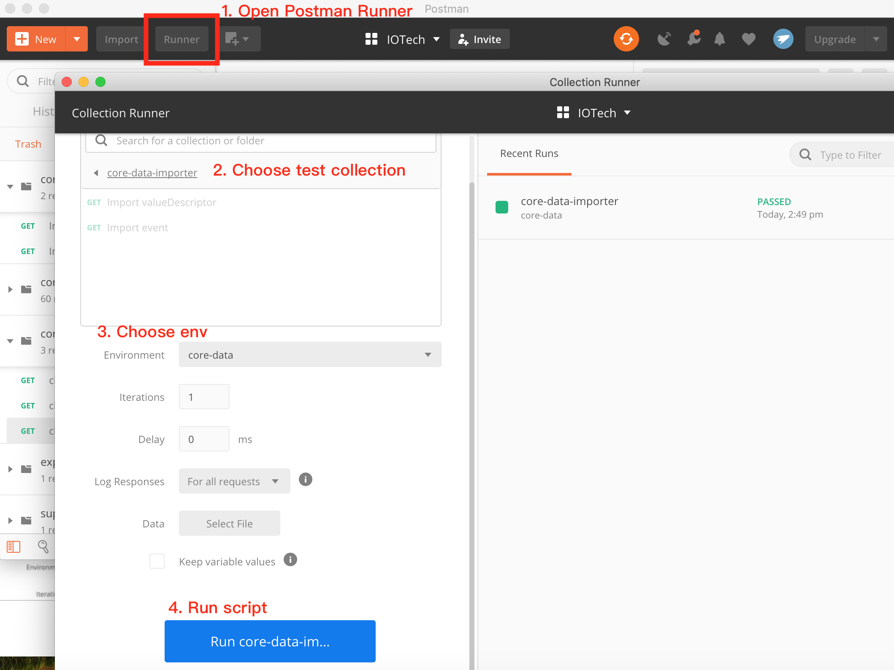

-----------------------------
Run Test Script Using Postman
-----------------------------

1. Import the **path/to/blackbox-testing/bin/postman-test/collections/core-data.postman_collection.json file**, this file describes the testing APIs and test assertions.

2. Choose a test folder and env

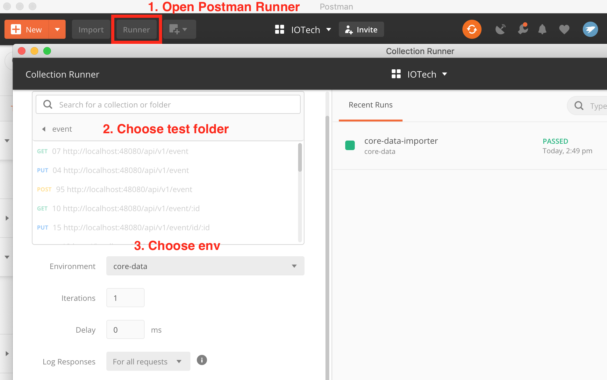

3. Select the **path/to/blackbox-testing/bin/postman-test/data/eventData.json** file and run tests.

.. image:: images/run-test-2.png

4. View the test result.

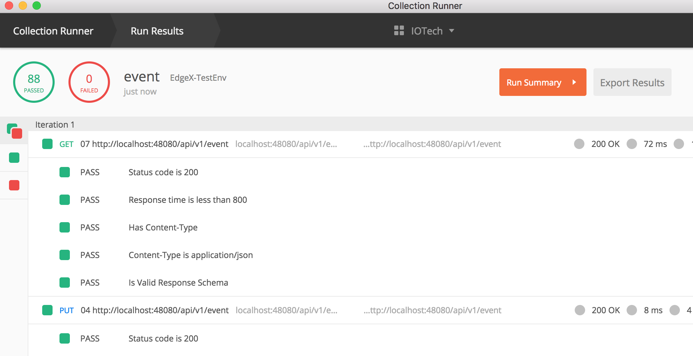

---------------
Clean test data
---------------

1. Add the **path/to/blackbox-testing/bin/postman-test/collections/core-data-cleaner.postman_collection.json** script

2. Execute the cleaner script in one of the following ways:

2-1. Execute the clean scripts one-by-one

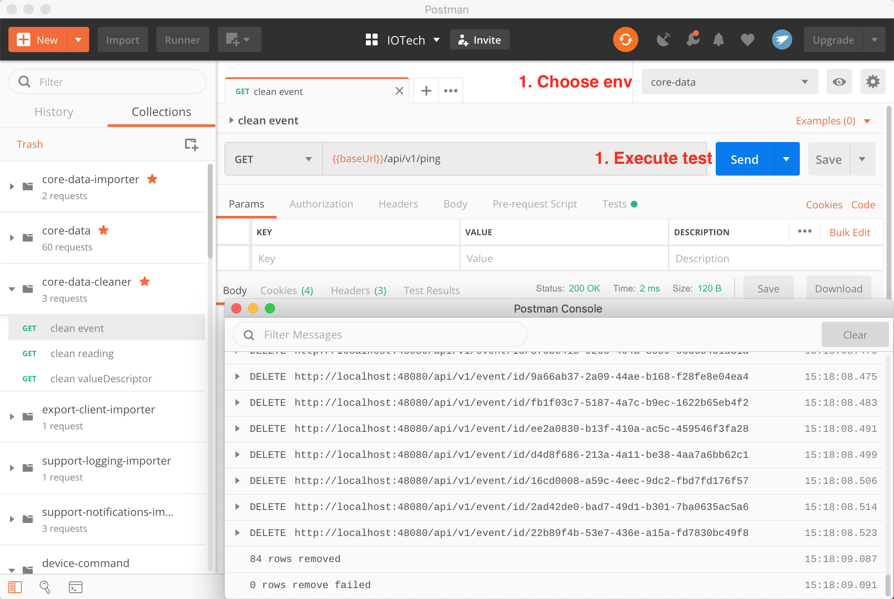

2-2. Execute the cleaner scripts using Postman Runner

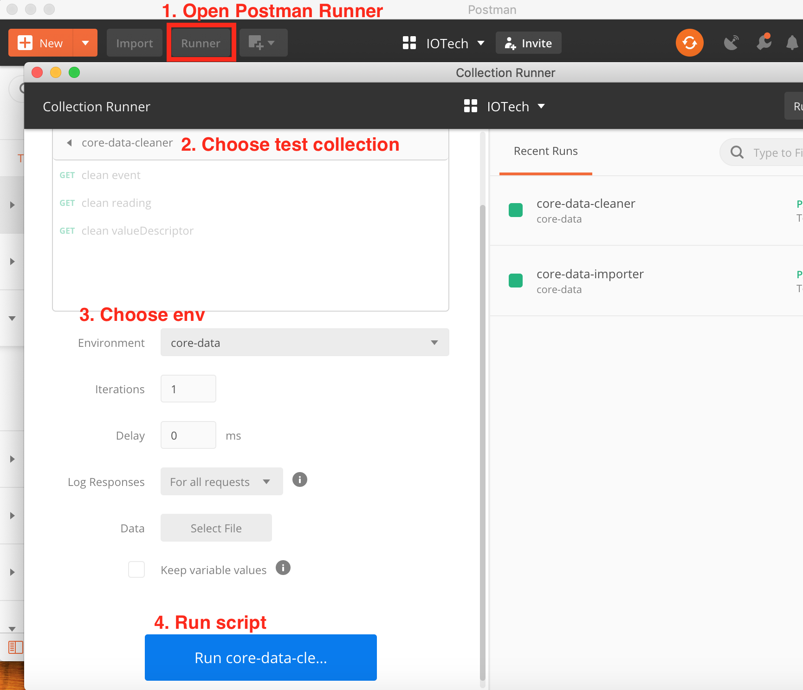

==========================
List of Test Prerequisites
==========================

------------
Core-Command
------------

To run core-command tests you must have the following services running before any beginning any tests:

1. mongo
2. core-data
3. core-metadata
4. core-command
5. device-virtual

Run the core-command-cleaner script, then the importer script, and finally the tests.

The core-command-cleaner collection requires the core-metadata environment. It does not require any data files.

The core-command-importer collection requires the core-metadata environment. It does not require any data files.

The core-command collection has four folders:
    1. device: this folder requires the core-command environment and the coreCommandData data file.
    2. device_error_4xx: this folder requires the core-command environment and the coreCommandData data file.
    3. ping: this folder requires the core-command environment. It does not require any data files.
    4. resources: this folder requires the core-command environment. It does not require any data files.

---------------------
Support-Notifications
---------------------

To run support-notification tests you must have the following services running before beginning any tests:

1. mongo
2. support-notifications

Run the support-notifications-cleaner script, then the importer script, and finally the tests.

The support-notifications-cleaner collection requires the support-notification environment. It does not require any
data files.

The support-notifications-importer collection requires the support-notification environment. It does not require any
data files.

The support-notifications collection has four folders:
    1. subscription: this folder requires the support-notification environment and the subscriptionData data file.
    2. notification: this folder requires the support-notification environment and the notificationData data file.
    3. transmission: this folder requires the support-notification environment and the transmissionData data file.
    4. ping: this folder requires the support-notification environment. It does not require any data files.
